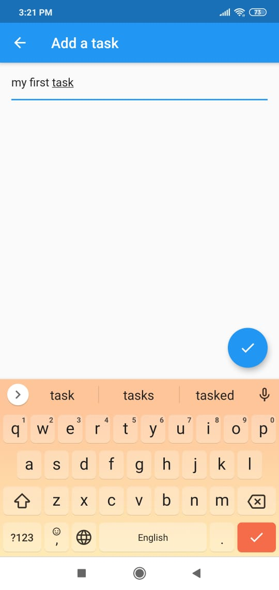

# VD_flutter_training_2.1

## To Do List

A simple Flutter application where you can add a task simply by clicking the floating action button with a '+' sign. Then you enter the details of the task and on completing press the done icon in the floating action button, it is entered in your list of existing tasks. 

You can also remove a task from the list after you deem it complete.

# Screenshots

## Initial page/Tasks page

## Add Task page

## Task added and pressing the done button

## Task Added

## Now we added more tasks

## Removed the second task by clicking the done icon provided along
